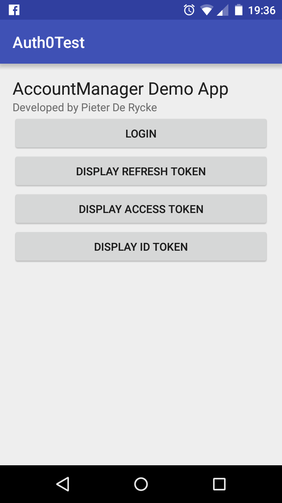
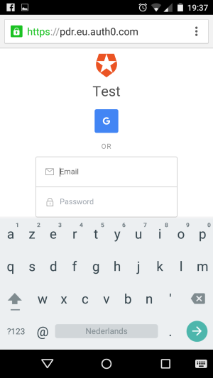

# Android AccountManager Openid Connect Sample

This is a sample application for Android that explains how you can use the AccountManager API of Android in combination with an OpenID Connect provider. For this sample I have relied on Auth0, a SAAS based STS. But you can also use the sample code in combination with ADFS 2016, Azure AD, ...

I am using the official Google OAuth library for Java (https://developers.google.com/api-client-library/java/google-api-java-client/dev-guide) to integrate with the OpenID Connect provider (OpenID Connect is a protocol on top of OAuth2). The advantage of relying on this library is that it takes care of most the OpenID Connect related details. There are multiple authentication options in OAuth2/OpenID Connect, but for this sample I make use of the Authorization Code Grant flow. This authentication option makes use of a login web page that is comming from the STS. For the sample I display the login page in the Android system browser and not in an embedded browser view. This is based on recommendations that can be found in: https://tools.ietf.org/html/draft-wdenniss-oauth-native-apps-00. The motivation behind this is that if you always rely on the system browser, you can 'train' your users only to enter their credentials when they see the DNS of your company over an HTTPS connection in the address bar.

 